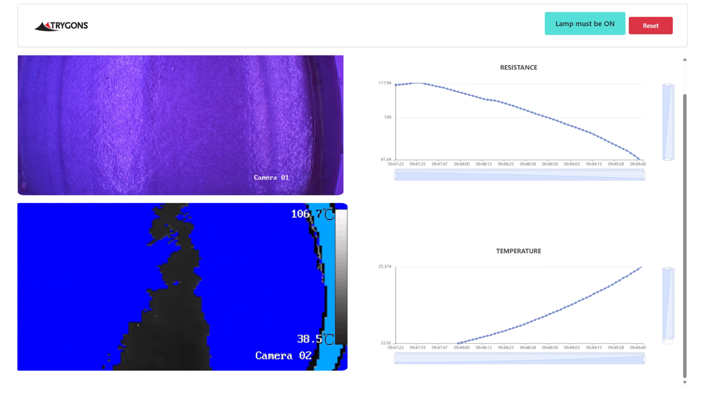

# ExoFuse: Agent-Driven Smart Energy Efficient Vacuum Infusion in Green Manufacturing

## Overview

ExoFuse is an innovative project that revolutionizes the Vacuum Infusion Process (VIP) for composite manufacturing by integrating Agent-driven technology with self-heating exothermic reactions. This project focuses on reducing energy consumption, increasing efficiency, and promoting sustainability within the composites manufacturing industry. By replacing traditional external heating methods with a self-heating curing process, ExoFuse aims to streamline production, cut costs, and reduce carbon emissions.

## Key Features

- **Self-Healing Exothermic Reaction**: The core of ExoFuse lies in its ability to utilize an exothermic reaction for curing composite materials. This approach eliminates the need for external heat sources, resulting in up to 90% energy savings.
  
- **Agent-Powered Temperature Control**: ExoFuse integrates advanced algorithms to monitor and control the curing process in real-time. This ensures optimal temperature conditions, preventing defects and inconsistencies in the final product.
  
- **Green Manufacturing**: The project emphasizes sustainable manufacturing practices by reducing energy consumption and minimizing carbon emissions. The self-heating process also allows for the production of larger composite parts without the limitations imposed by traditional oven-based methods.
  
- **Versatility**: ExoFuse is designed to be applicable across various composite materials and reinforcement types, making it a versatile solution for different manufacturing needs.

## Project Objectives

1. **Reduce Production Time**: Significantly accelerate the curing process, enabling faster production cycles and increased efficiency.
  
2. **Energy Savings**: Minimize the reliance on external heating methods, optimizing energy use, and reducing operational costs.
  
3. **Sustainability**: Contribute to a greener manufacturing process by reducing carbon emissions and embracing environmentally friendly technologies.

## Benefits of ExoFuse

- **Energy Efficiency**: Achieves substantial energy savings by utilizing self-heating curing processes, reducing the overall carbon footprint of the manufacturing process.
  
- **Cost Reduction**: Lowers production costs by eliminating the need for expensive heating equipment and reducing energy consumption.
  
- **Improved Product Quality**: Agent-driven monitoring ensures precise control over the curing process, resulting in higher quality composite parts with fewer defects.
  
- **Manufacturing Flexibility**: The elimination of large ovens allows for greater flexibility in the size and shape of parts that can be manufactured, enabling the use of  materials like carbon fiber.

## Installation and Usage

### Installation and Usage: Data Collection Module

The first section of the ExoFuse project involves a data collection module that connects to a sensor via TCP/IP to gather temperature and resistance data. The collected data is then posted to an API endpoint for further processing.

#### Steps to Set Up and Run the Data Collection Module:

1. **Install Dependencies**:
   Ensure you have Python installed, and install the required packages using pip:
   ```bash
   pip install requests
   ```

2. **Configure the Sensor Connection**:
   Update the sensor's IP address and port in the script (`app.py`):
   ```python
   SensorIP = '192.168.1.186'
   SensorPort = 25555
   ```

3. **Run the Script**:
   Execute the script to start collecting data from the sensor:
   ```bash
   python app.py
   ```

4. **Data Posting**:
   The script continuously reads data from the sensor and posts it to the specified API endpoint (`http://127.0.0.1:5000/api/add_data`).

This module is crucial for real-time data collection, feeding the system with the necessary inputs for further processing in the ExoFuse pipeline. 

---

### Installation and Usage: Data Analysis and API Module

The second part of the ExoFuse project involves a data analysis module that processes the data collected from the sensors and provides real-time feedback through an API. This module identifies key points in the curing process: the gelling point, the point to turn off the light, and the final curing point.

#### Steps to Set Up and Run the Data Analysis and API Module:

1. **Install Dependencies**:
   Ensure you have Python and Flask installed. Install the required packages using pip:
   ```bash
   pip install flask flask-cors opencv-python
   ```

2. **Run the API Server**:
   Start the Flask server to begin analyzing data and providing API endpoints:
   ```bash
   python main.py
   ```

3. **API Endpoints**:
   - `/api/add_data`: Accepts sensor data and processes it.
   - `/api/get_data`: Retrieves processed data including key points such as gelling point and curing point.
   - `/api/reset_data`: Resets the stored data for a new analysis session.

4. **Real-Time Monitoring**:
   The module continuously analyzes resistance and temperature data to provide real-time insights into the curing process, helping to optimize and control the process more effectively.

This module is critical for the real-time monitoring and control of the curing process, enabling precise adjustments to be made for optimal results. 

---

### Installation and Usage: Dashboard Interface Module

The final part of the ExoFuse project is a React-based dashboard that provides a visual interface for monitoring the real-time data and insights generated by the system. This dashboard displays a thermal camera feed, an RGB camera feed, and two dynamic graphs—one showing resistance data and the other displaying temperature data.

#### Steps to Set Up and Run the Dashboard:

1. **Install Dependencies**:
   Ensure you have Node.js and npm installed. Navigate to the dashboard directory and install the required packages:
   ```bash
   npm install
   ```

2. **Run the Dashboard**:
   Start the React development server to launch the dashboard:
   ```bash
   npm start
   ```

3. **Dashboard Features**:
   - **Thermal Camera**: Displays real-time thermal imagery for monitoring temperature distribution.
   - **RGB Camera**: Provides a real-time visual feed from an RGB camera for general monitoring.
   - **Resistance Graph**: Plots the resistance data in real-time, providing insights into the material's changing properties during the curing process.
   - **Temperature Graph**: Tracks temperature data over time, helping to ensure that the curing process stays within optimal parameters.

4. **Screenshots**:
   
   

This dashboard allows users to easily visualize and monitor the critical aspects of the curing process, making it easier to make informed decisions and adjustments in real-time. 

---

## Contributors

- **TRYGONS SA**: Lead manufacturing partner specializing in composite parts production for the marine and automotive sectors.
- **iThermAgent B.V.**: Technology partner providing expertise in Agent-driven thermal monitoring and control systems.

## Acknowledgments

ExoFuse is a collaborative effort that brings together expertise in Agent, composites manufacturing, and sustainable technology. We thank our partners and contributors for their valuable support in making this project a reality.
